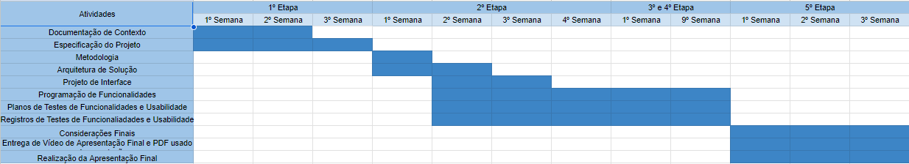
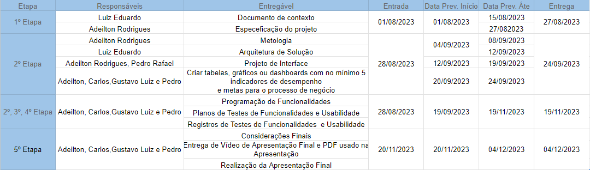
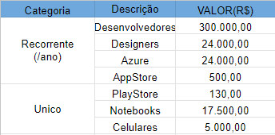

# Especificações do Projeto

A definição exata do problema e outros pontos relevantes a serem tratados no projeto estão descritos aqui. Eles foram levantados e produzidos usando as seguintes ferramentas e tecnicas: 

1. Entrevistas e Discussões com jogadores e desenvolvedores
2. Documentação de Requisito
3. Ferramentas de Modelagem Visual (draw.io)
4. Ferramentas de Gerenciamento de Projetos (Github Projects)

## Personas

<table>
<thead>
  <tr>
    <th>Persona 1</th>
    <th colspan="2">Déssio Pinto Rosa</th>
  </tr>
</thead>
<tbody>
  <tr>
    <td></td>
    <td>● Idade: 22 anos. ● Ocupação: Universitário</td>
    <td>● Joga com os amigos no final do horário da faculdade.</td>
  </tr>
  <tr>
    <td>Motivação:
       &emsp;● Jogar com os amigos.
       &emsp;● Conhecer pessoas que também gostam de jogos no estilo roguelike.
       &emsp; ● Colecionar Skins em jogos. 
    </td>
    <td>Objetivo: &emsp;● Divertir-se com seus amigos</td>
    <td>Frustração:
       &emsp;● Tem medo de falar com mulheres, por isso se afunda em jogos e relacionamentos.
    </td>
  </tr>
</tbody>
</table>

<table>
<thead>
  <tr>
    <th>Persona 2</th>
    <th colspan="2">Isadora Pinto Magalhães</th>
  </tr>
</thead>
<tbody>
  <tr>
    <td></td>
    <td>● Idade: 18 anos
     ● Ocupação: Influenciadora digital</td>
    <td>● Faz lives jogando com seus seguidores</td>
  </tr>
  <tr>
    <td>Motivação: &emsp;● Divertir-se jogando seu estilo de jogo favorito </td>
    <td>Objetivo: &emsp;● Achar um jogo que gere conteúdo para seus fãs</td>
    <td>Frustração: &emsp;● Não encontrou um jogo no estilo roguelike que a desafie</td>
  </tr>
</tbody>
</table>

## Histórias de Usuários

Com base na análise das personas forma identificadas as seguintes histórias de usuários:

|EU COMO... `PERSONA`| QUERO/PRECISO ... `FUNCIONALIDADE` |PARA ... `MOTIVO/VALOR`                 |
|--------------------|------------------------------------|----------------------------------------|
|Usuário do sistema  | Registrar minhas tarefas           | Não esquecer de fazê-las               |
|Administrador       | Alterar permissões                 | Permitir que possam administrar contas |

Apresente aqui as histórias de usuário que são relevantes para o projeto de sua solução. As Histórias de Usuário consistem em uma ferramenta poderosa para a compreensão e elicitação dos requisitos funcionais e não funcionais da sua aplicação. Se possível, agrupe as histórias de usuário por contexto, para facilitar consultas recorrentes à essa parte do documento.

> **Links Úteis**:
> - [Histórias de usuários com exemplos e template](https://www.atlassian.com/br/agile/project-management/user-stories)
> - [Como escrever boas histórias de usuário (User Stories)](https://medium.com/vertice/como-escrever-boas-users-stories-hist%C3%B3rias-de-usu%C3%A1rios-b29c75043fac)
> - [User Stories: requisitos que humanos entendem](https://www.luiztools.com.br/post/user-stories-descricao-de-requisitos-que-humanos-entendem/)
> - [Histórias de Usuários: mais exemplos](https://www.reqview.com/doc/user-stories-example.html)
> - [9 Common User Story Mistakes](https://airfocus.com/blog/user-story-mistakes/)

## Modelagem do Processo de Negócio 

### Análise da Situação Atual

Apresente aqui os problemas existentes que viabilizam sua proposta. Apresente o modelo do sistema como ele funciona hoje. Caso sua proposta seja inovadora e não existam processos claramente definidos, apresente como as tarefas que o seu sistema pretende implementar são executadas atualmente, mesmo que não se utilize tecnologia computacional. 

### Descrição Geral da Proposta

Apresente aqui uma descrição da sua proposta abordando seus limites e suas ligações com as estratégias e objetivos do negócio. Apresente aqui as oportunidades de melhorias.

### Processo 1 – NOME DO PROCESSO

Apresente aqui o nome e as oportunidades de melhorias para o processo 1. Em seguida, apresente o modelo do processo 1, descrito no padrão BPMN. 

### Processo 2 – NOME DO PROCESSO

Apresente aqui o nome e as oportunidades de melhorias para o processo 2. Em seguida, apresente o modelo do processo 2, descrito no padrão BPMN.

## Indicadores de Desempenho

Apresente aqui os principais indicadores de desempenho e algumas metas para o processo. Atenção: as informações necessárias para gerar os indicadores devem estar contempladas no diagrama de classe. Colocar no mínimo 5 indicadores. 

Usar o seguinte modelo: 

Obs.: todas as informações para gerar os indicadores devem estar no diagrama de classe a ser apresentado a posteriori. 

## Requisitos

As tabelas que se seguem apresentam os requisitos funcionais e não funcionais que detalham o escopo do projeto. Para determinar a prioridade de requisitos, aplicar uma técnica de priorização de requisitos e detalhar como a técnica foi aplicada.

### Requisitos Funcionais

| ID   | Descrição do Requisito                                                            | Prioridade |
|------|-----------------------------------------------------------------------------------|------------|
| RF-1 | Combate baseado em turnos.                                                        | ALTA       |
| RF-2 | Permitir a evolução do player com itens conquistados.                             | ALTA       |
| RF-3 | Novas habilidades devem ser liberadas gradualmente.                               | ALTA       |
| RF-4 | Permitir evolução de atributos bases                                              | ALTA       |
| RF-5 | Poder recomeçar uma masmorra assim que finalizada mantendo as cartas conquistadas | ALTA       |
| RF-6 | Ter como ver suas conquistas                                                      | MÉDIA      |
| RF-7 | Grimório com as cartas que já foram descobertas                                   | MÉDIA      |
| RF-8 | Bestiário                                                                         | MÉDIA      |
| RF-9 | Masmorras Completadas                                                             | MÉDIA      |

### Requisitos não Funcionais

| ID    | Descrição do Requisito                                                                   | Prioridade |
|-------|------------------------------------------------------------------------------------------|------------|
| RNF-1 | O jogo deve estar disponível para dispositivos móveis                                    | ALTA       |
| RNF-2 | O jogo deve estar disponível para plataformas web                                        | ALTA       |
| RNF-3 | As informações relevantes dos jogadores precisam estar protegidas de acessos indevidos   | ALTA       |
| RNF-4 | O codigo precisa ser criado para facilitar manuntenção e extensão futura                 | MEDIA      |
| RNF-5 | A interface precisa expressar as regras do jogo de maneira intuitiva e facil de aprender | ALTA       |
| RNF-6 | A aplicação deve responder os comandos em tempo real                                     | ALTA       |

## Restrições

O projeto está restrito pelos itens apresentados na tabela a seguir.

|ID| Restrição                                             |
|--|-------------------------------------------------------|
|01| O projeto deverá ser entregue até o final do semestre |
|02| Não pode ser desenvolvido um módulo de backend        |

Enumere as restrições à sua solução. Lembre-se de que as restrições geralmente limitam a solução candidata.

> **Links Úteis**:
> - [O que são Requisitos Funcionais e Requisitos Não Funcionais?](https://codificar.com.br/requisitos-funcionais-nao-funcionais/)
> - [O que são requisitos funcionais e requisitos não funcionais?](https://analisederequisitos.com.br/requisitos-funcionais-e-requisitos-nao-funcionais-o-que-sao/)

## Diagrama de Casos de Uso

O diagrama de casos de uso é o próximo passo após a elicitação de requisitos, que utiliza um modelo gráfico e uma tabela com as descrições sucintas dos casos de uso e dos atores. Ele contempla a fronteira do sistema e o detalhamento dos requisitos funcionais com a indicação dos atores, casos de uso e seus relacionamentos. 

As referências abaixo irão auxiliá-lo na geração do artefato “Diagrama de Casos de Uso”.

> **Links Úteis**:
> - [Criando Casos de Uso](https://www.ibm.com/docs/pt-br/elm/6.0?topic=requirements-creating-use-cases)
> - [Como Criar Diagrama de Caso de Uso: Tutorial Passo a Passo](https://gitmind.com/pt/fazer-diagrama-de-caso-uso.html/)
> - [Lucidchart](https://www.lucidchart.com/)
> - [Astah](https://astah.net/)
> - [Diagrams](https://app.diagrams.net/)

# Matriz de Rastreabilidade

A matriz de rastreabilidade é uma ferramenta usada para facilitar a visualização dos relacionamento entre requisitos e outros artefatos ou objetos, permitindo a rastreabilidade entre os requisitos e os objetivos de negócio. 

A matriz deve contemplar todos os elementos relevantes que fazem parte do sistema, conforme a figura meramente ilustrativa apresentada a seguir.

> **Links Úteis**:
> - [Artigo Engenharia de Software 13 - Rastreabilidade](https://www.devmedia.com.br/artigo-engenharia-de-software-13-rastreabilidade/12822/)
> - [Verificação da rastreabilidade de requisitos usando a integração do IBM Rational RequisitePro e do IBM ClearQuest Test Manager](https://developer.ibm.com/br/tutorials/requirementstraceabilityverificationusingrrpandcctm/)
> - [IBM Engineering Lifecycle Optimization – Publishing](https://www.ibm.com/br-pt/products/engineering-lifecycle-optimization/publishing/)

# Gerenciamento de Projeto

De acordo com o PMBoK v6 as dez áreas que constituem os pilares para gerenciar projetos, e que caracterizam a multidisciplinaridade envolvida, são: Integração, Escopo, Cronograma (Tempo), Custos, Qualidade, Recursos, Comunicações, Riscos, Aquisições, Partes Interessadas. Para desenvolver projetos um profissional deve se preocupar em gerenciar todas essas dez áreas. Elas se complementam e se relacionam, de tal forma que não se deve apenas examinar uma área de forma estanque. É preciso considerar, por exemplo, que as áreas de Escopo, Cronograma e Custos estão muito relacionadas. Assim, se eu amplio o escopo de um projeto eu posso afetar seu cronograma e seus custos.

## Gerenciamento de Tempo

O gráfico de Gantt ou diagrama de Gantt também é uma ferramenta visual utilizada para controlar e gerenciar o cronograma de atividades de um projeto. Com ele, é possível listar tudo que precisa ser feito para colocar o projeto em prática, dividir em atividades e estimar o tempo necessário para executá-las.

## Gerenciamento de Equipe

O gerenciamento adequado de tarefas contribuirá para que o projeto alcance altos níveis de produtividade. Por isso, é fundamental que ocorra a gestão de tarefas e de pessoas, de modo que os times envolvidos no projeto possam ser facilmente gerenciados. 

## Gestão de Orçamento

O processo de determinar o orçamento do projeto é uma tarefa que depende, além dos produtos (saídas) dos processos anteriores do gerenciamento de custos, também de produtos oferecidos por outros processos de gerenciamento, como o escopo e o tempo.

